- 2022 最新基于SpringBoot/SSM的房屋租赁系统 Rello
- 预览地址：[http://rello.liuyanzhao.com](http://rello.liuyanzhao.com)
- 详细介绍地址：[https://liuyanzhao.com/shop/rello.html](https://liuyanzhao.com/shop/rello.html)
- 代码地址：https://github.com/saysky/rello-boot 或 https://gitee.com/saysky/rello-boot
- 完成时间：2022年4月
- 该项目有SpringBoot和SSM2个版本，当前项目是SSM版本，预计下半年会出Vue版本
- 博主的其他租房系统请前往 [https://liuyanzhao.com/shop.html?k=租房](https://liuyanzhao.com/shop.html?k=租房)

# 一、功能介绍
- 租客功能
  - 创建订单、签订合同、支付订单
  - 查看我的租房信息，故障报修
  - 查看订单，取消订单，退租
  - 发布求租信息、求租留言、查看求租信息、查看求租留言
  - 查看账单信息、支付账单
  - 收藏房源、查看收藏房源
  - 私信房东，查看未读私信，回复私信
  - 修改个人信息、修改密码
  - 创建反馈，查看反馈

- 房东功能
  - 发布房源、房源管理、上架、下架、删除
  - 给订单创建水电费账单
  - 故障报修受理
  - 审核租客的退租申请
  - 私信租客，查看未读私信，回复私信
  - 修改个人信息、修改密码
  - 创建反馈，查看反馈

- 管理员功能
  - 几乎所有功能
  - 用户管理、查看用户详情
  - 房源查看
  - 订单查看
  - 账单查看
  - 私信房东或租客，查看未读私信，回复私信
  - 发布新闻资讯公告，管理新闻
  - 反馈查看，处理租客和房东的反馈信息

可以看如下图

# 二、技术组成
- 1、SpringBoot 或 SSM
- 2、MyBatis
- 3、JSP
- 4、Bootstrap
- 5、MySQL

代码结构.png  
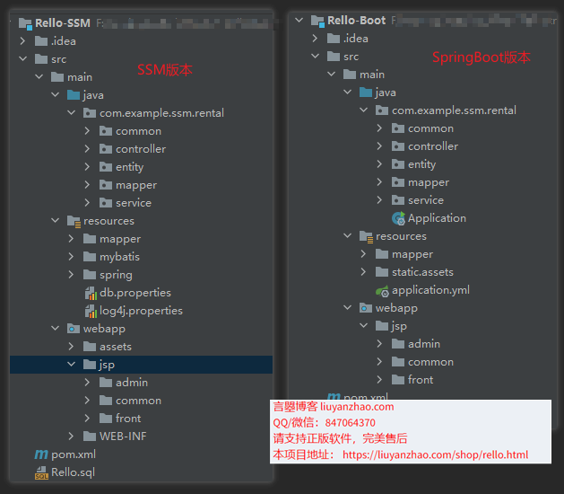
数据库设计.png  

# 三、项目截图
3-首页.png

4-房子列表.png
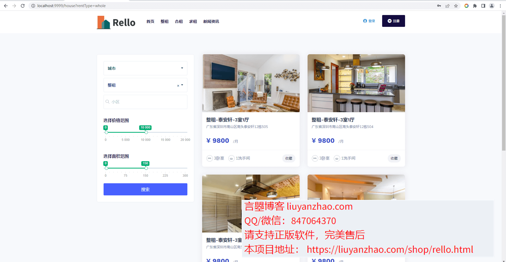
5-房子详情-1.png
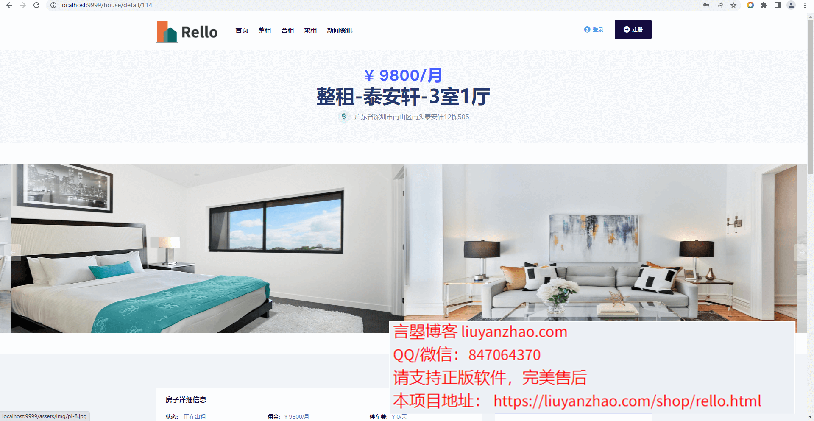
6-房子详情-2.png
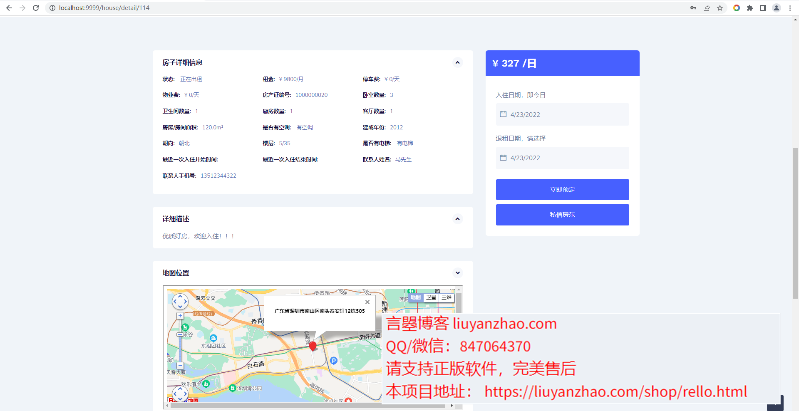
7-签订合同页面.png
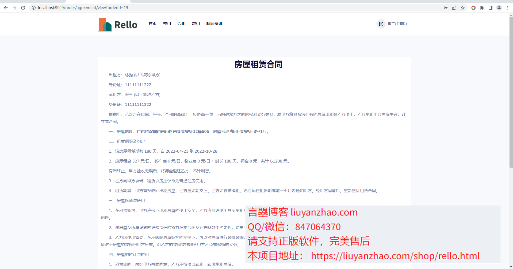
8-租客支付订单页面.png
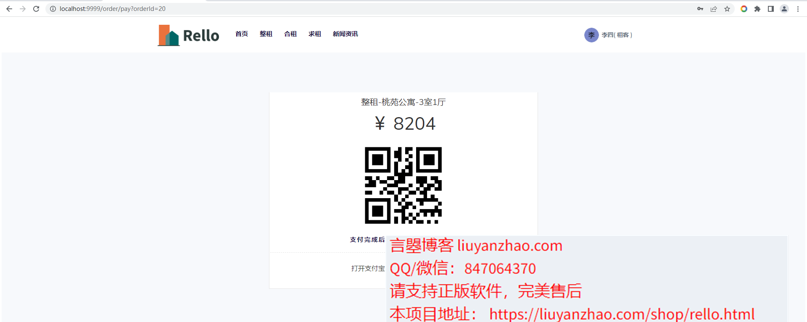
9-租客我的家页面.png

10-租客我的订单页面.png
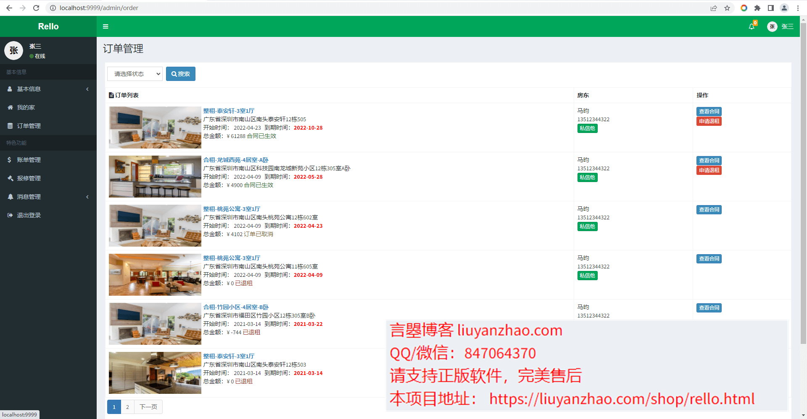
11-租客账单页面.png

12-租客报修页面.png

13-租客求租文章管理页面.png
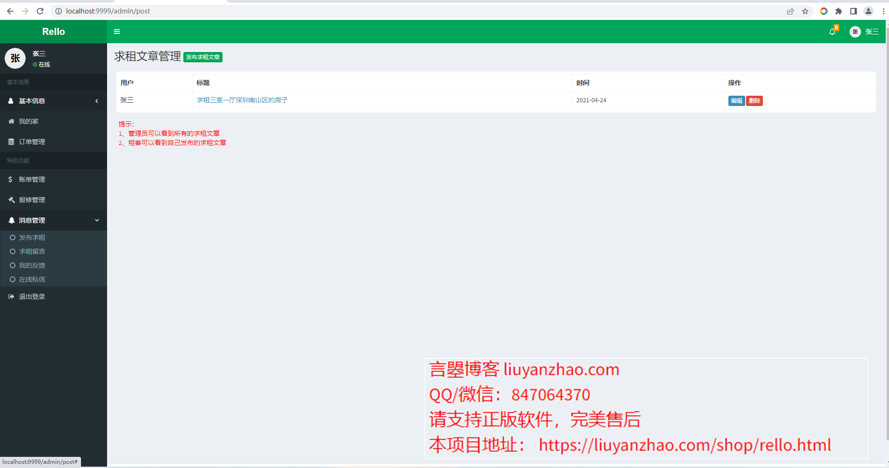
14-租客求租留言页面.png
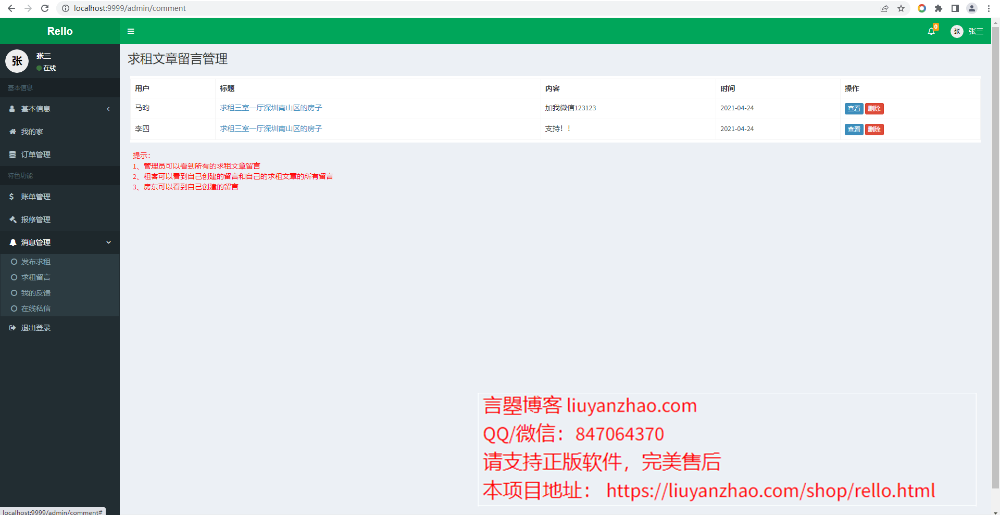
15-租客反馈列表页面.png
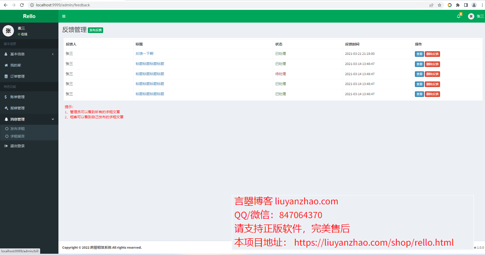
16-私信页面.png
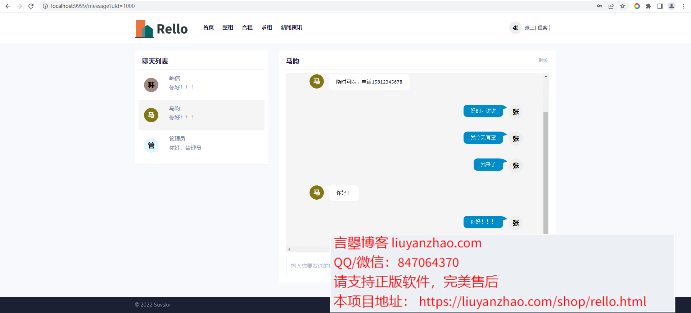
17-个人信息.png
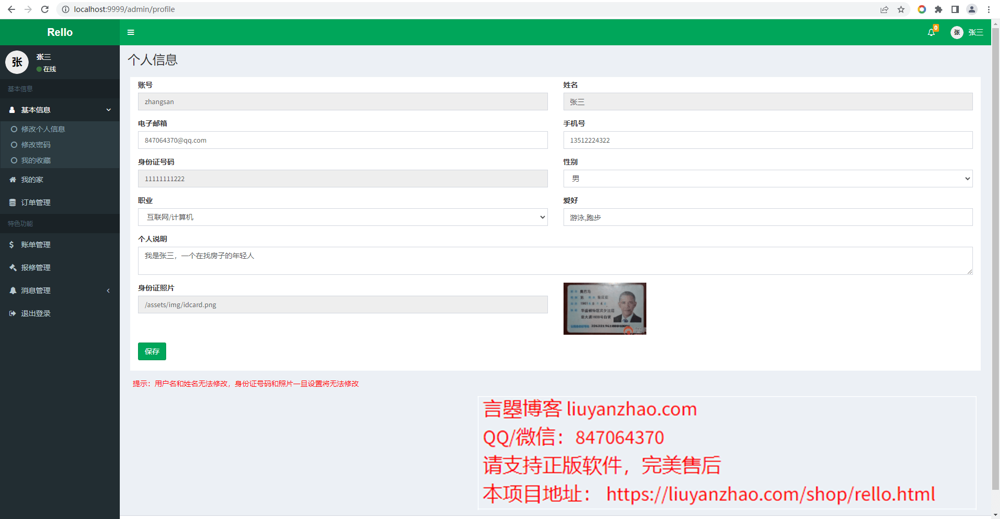
18-我的收藏.png
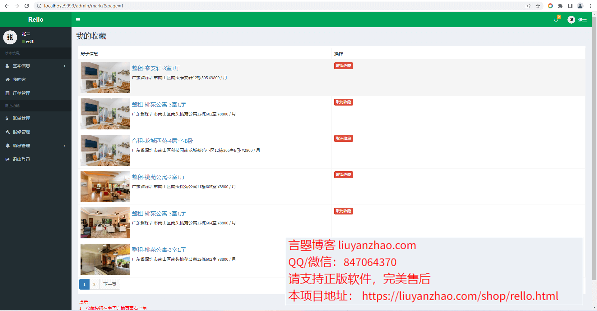
19-个人信息.png
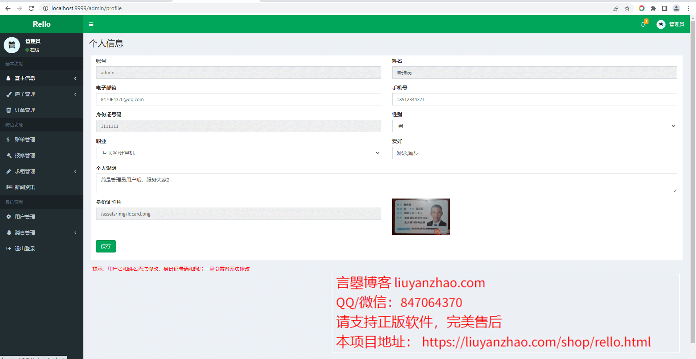
20-用户管理.png
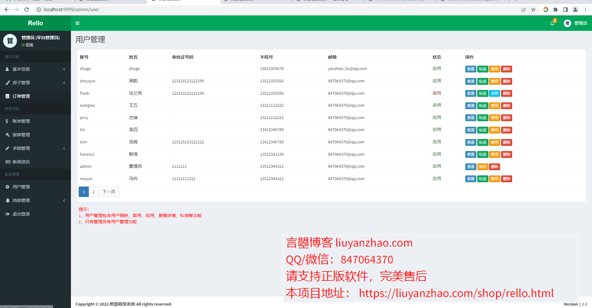
21-新闻资讯.png
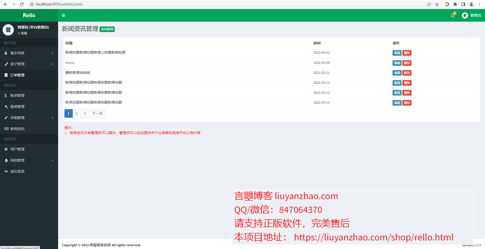
22-房东的房子管理.png

23-编辑房源信息.png
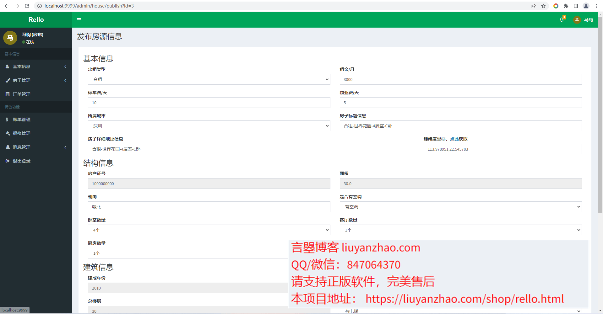
24-房东的订单管理.png
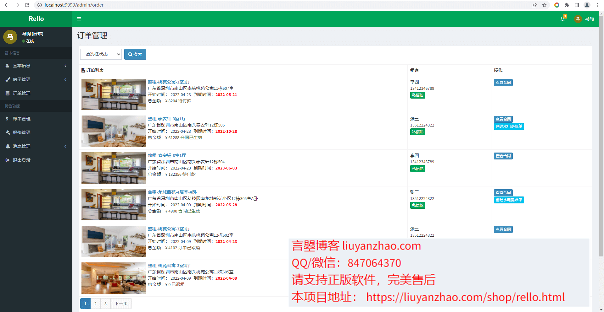
25-房东报修处理.png

# 四、联系方式
需要完整代码联系博主，微信847064370

